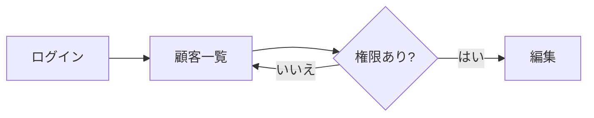
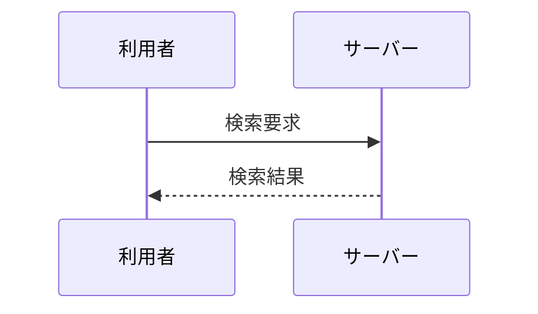

# Mermaid図

## 画面遷移


```mermaid
flowchart LR
  ログイン --> 一覧[顧客一覧]
  一覧 --> 詳細{権限あり?}
  詳細 -->|はい| 編集
  詳細 -->|いいえ| 一覧
```

## 処理の流れ


```mermaid
sequenceDiagram
  participant 利用者
  participant サーバー
  利用者->>サーバー: 検索要求
  サーバー-->>利用者: 検索結果
```

## 構文エラーの図

描画できない図は、コードのまま出力される。

```mermaid
flowchart TD
  A -->
```

## 通常のコード

```sql
SELECT * FROM customers;
```
